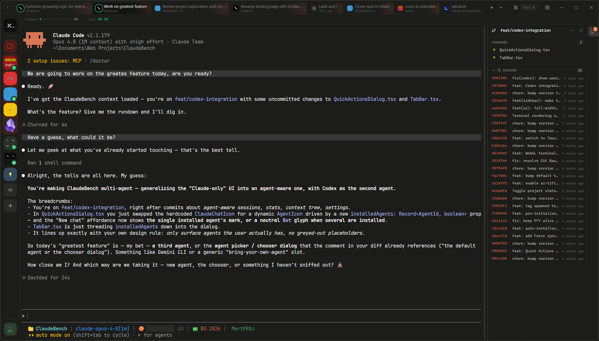

<div align="center">


# xshell

**A tiny IDE for your AI CLI agents.**

[](LICENSE)
[](https://github.com/MertPROJ/xshell/releases/latest)
[](https://github.com/MertPROJ/xshell/releases/latest)
[](https://tauri.app/)
[](https://www.rust-lang.org/)

</div>

> Independent project. Not affiliated with, endorsed by, or a product of Anthropic, OpenAI, Anysphere, Google, or any other agent vendor. xshell reads the session files written by the official agent CLIs (`claude`, `codex`, `cursor-agent`, `opencode`, `agy`) and spawns them as subprocesses. All product names, logos, and brands are trademarks of their respective owners.

## Preview

<p align="center">
  
</p>

<p align="center">
  🌐 <a href="https://xshell.sh"><strong>xshell.sh</strong></a>
</p>

## Why this exists

Open terminal. `cd` somewhere. Type `claude` — or `codex`, or `agy`. Repeat for every project, every day.

xshell skips that. All your agents, all your projects, all your past sessions, all the costs — one screen, one click.

## How it works

xshell reads the session files each agent CLI writes to disk (`~/.claude/`, `~/.codex/`, and so on) and spawns the official CLI when you start or resume a session. No API proxy, no telemetry, no replacement implementation. If an agent CLI works on your machine, xshell works.

## What you see

Every project on your machine that any of your agents has touched. Every session, sorted by what you opened last. Cost and token usage per session, per project, per day — wherever the agent records it.

The data is all on your disk already. xshell just shows it in one place.

## Supported agents

xshell auto-detects whichever of these agent CLIs are installed and lists their projects and sessions — no setup needed. Only the agents you actually have show up in the UI.

| Agent | Binary | Sessions read from | Extras |
| --- | --- | --- | --- |
| **Claude Code** | `claude` | `~/.claude/projects` | Cost, context %, rate limits, context tree |
| **Codex** | `codex` | `~/.codex/sessions` | Tokens, context %, rate limits, context tree |
| **Cursor** | `cursor-agent` | `~/.cursor/chats` | Context tree |
| **opencode** | `opencode` | opencode's local database | Tokens, context %, context tree |
| **Antigravity** | `agy` | `~/.gemini/antigravity-cli` | Context tree |

More agents are on the way — the registry is built to grow.

## Features

- 🗂️ **Sidebar with every project** your agents have touched. Pin, group, drag-and-drop.
- 📜 **One-click session resume** with full history per project.
- 💻 **Real terminals**, splittable side-by-side. [xterm.js](https://xtermjs.org) + native PTYs.
- 🌿 **Live branch and worktree awareness** in the sidebar.
- 🧩 **Context tree** for skills, agents, plugins, MCP servers, hooks, slash commands, and CLAUDE.md.
- 📊 **Cost, context, and rate-limit tracking** per session and across your account.
- 🪶 **Inline git panel** with diff counts and staging.

Built with Tauri 2 and Rust. Native on Windows, macOS, and Linux.

## Install

The fastest way — one line, works everywhere:

**Windows (PowerShell)**

```powershell
irm https://xshell.sh/install.ps1 | iex
```

**macOS / Linux**

```bash
curl -fsSL https://xshell.sh/install.sh | bash
```

The script downloads the right binary for your platform from the [latest GitHub release](https://github.com/MertPROJ/xshell/releases/latest) into `~/.xshell/bin/`, drops a Start Menu / `.desktop` entry, adds itself to `PATH`, and launches the app. Re-run the same command to update.

### Or download an installer directly

| Platform | File |
| --- | --- |
| Windows | `xshell_<version>_x64_en-US.msi` or `xshell_<version>_x64-setup.exe` |
| macOS | `xshell_<version>_universal.dmg` |
| Linux | `xshell_<version>_amd64.deb`, `xshell-<version>-1.x86_64.rpm`, or `xshell_<version>_amd64.AppImage` |

At least one [supported agent CLI](#supported-agents) must be installed and on `PATH`.

## Contributing

Issues and pull requests welcome. See [CONTRIBUTING.md](./CONTRIBUTING.md) for development setup, project structure, and PR guidelines.

## License

[MIT](./LICENSE) © 2026 xshell Contributors

xshell is independent software. It reads the session files written by the official agent CLIs and runs them as subprocesses. All product names, logos, and brands are trademarks of their respective owners.
