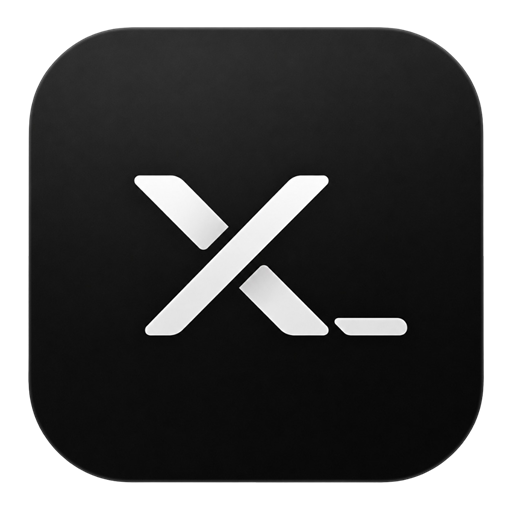
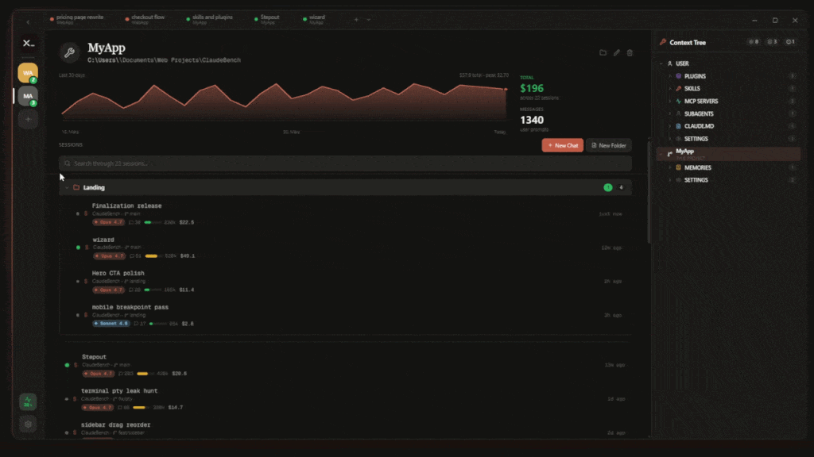

<div align="center">



# xshell

**A native home for your Claude Code sessions.**

[](LICENSE)
[](https://github.com/MertPROJ/xshell/releases/latest)
[](https://github.com/MertPROJ/xshell/releases/latest)
[](https://tauri.app/)
[](https://www.rust-lang.org/)

</div>

> Independent project. Not affiliated with, endorsed by, or a product of Anthropic. xshell reads files written by the official `claude` CLI and spawns it as a subprocess. "Claude" and "Claude Code" are trademarks of Anthropic, PBC.

## Preview

<p align="center">
  
</p>

<p align="center">
  🌐 <a href="https://xshell.sh"><strong>xshell.sh</strong></a>
</p>

## Why this exists

Open terminal. `cd` somewhere. Type `claude`. Repeat for every project, every day.

xshell skips that. All your projects, all your past sessions, all the costs — one screen, one click.

## How it works

xshell reads the files Claude Code writes to `~/.claude/` and spawns the `claude` CLI when you start a session. No API proxy, no telemetry, no replacement implementation. If Claude Code works on your machine, xshell works.

## What you see

Every project on your machine that Claude Code has touched. Every session, sorted by what you opened last. Cost per session, per project, per day.

The data is all in `~/.claude/` already. xshell just shows it in one place.

## Features

- 🗂️ **Sidebar with every project** Claude Code has touched. Pin, group, drag-and-drop.
- 📜 **One-click session resume** with full history per project.
- 💻 **Real terminals**, splittable side-by-side. [xterm.js](https://xtermjs.org) + native PTYs.
- 🌿 **Live branch and worktree awareness** in the sidebar.
- 🧩 **Context tree** for skills, agents, plugins, MCP servers, hooks, slash commands, and CLAUDE.md.
- 📊 **Cost, context, and rate-limit tracking** per session and across your account.
- 🪶 **Inline git panel** with diff counts and staging.

Built with Tauri 2 and Rust. Native on Windows, macOS, and Linux.

## Install

The fastest way — one line, works everywhere:

**Windows (PowerShell)**

```powershell
irm https://xshell.sh/install.ps1 | iex
```

**macOS / Linux**

```bash
curl -fsSL https://xshell.sh/install.sh | bash
```

The script downloads the right binary for your platform from the [latest GitHub release](https://github.com/MertPROJ/xshell/releases/latest) into `~/.xshell/bin/`, drops a Start Menu / `.desktop` entry, adds itself to `PATH`, and launches the app. Re-run the same command to update.

### Or download an installer directly

| Platform | File |
| --- | --- |
| Windows | `xshell_<version>_x64_en-US.msi` or `xshell_<version>_x64-setup.exe` |
| macOS | `xshell_<version>_universal.dmg` |
| Linux | `xshell_<version>_amd64.deb`, `xshell-<version>-1.x86_64.rpm`, or `xshell_<version>_amd64.AppImage` |

The `claude` CLI must be installed and on `PATH`.

## Contributing

Issues and pull requests welcome. See [CONTRIBUTING.md](./CONTRIBUTING.md) for development setup, project structure, and PR guidelines.

## License

[MIT](./LICENSE) © 2026 xshell Contributors

xshell is independent software. It reads files written by Anthropic's `claude` CLI and runs `claude` as a subprocess. "Claude" and "Claude Code" are trademarks of Anthropic, PBC.
